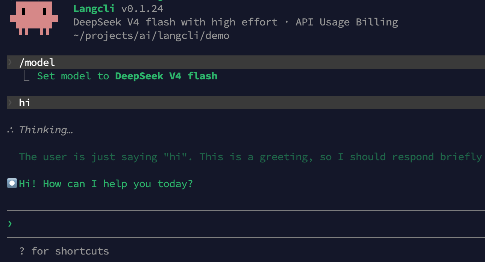

<div align="center">

# Make Claude Code 17x cheaper with DeepSeek V4

[English](./README.md) | [简体中文](./README.zh-CN.md)
</div>

<div align="left">

Claude Code is the best autonomous coding agent — but it costs $200/month with usage caps. 
DeepSeek V4 Pro scores 96.4% on LiveCodeBench and costs $0.87/M output tokens.

[Langcli](https://github.com/LangcliTeam/langcli) is an open sourced interactive AI coding assistant in the terminal, built upon the leaked code of Claude Code. 
Therefore, the way to use Langcli is exactly the same as that of standard Claude Code. 

In this tutorial, we use Langcli to demonstrate how to write code with DeepSeek V4.

## Installation

##### Quick Install (Recommended)

For macOS, Linux and WSL users, run the following command to install Langcli:

```bash
bash -c "$(curl -fsSL https://assets.langcli.com/installation/install-langcli.sh)"
```

For Windows users, run the following command instead (Run as Administrator CMD):

```cmd
cmd /c "curl -fsSL -o %TEMP%\install-langcli.bat https://assets.langcli.com/installation/install-langcli.bat && %TEMP%\install-langcli.bat"
```
> **Note**: It's recommended to restart your terminal after installation to ensure environment variables take effect.

##### Manual Installation

Make sure you have Node.js 20 or later installed. Otherwise download it from [nodejs.org](https://nodejs.org/en/download) and install first.
```bash
npm i -g langcli-com
```

## Quick Start

##### API Key Preparation
 Go to [LangRouter](https://langrouter.ai/), register an account, save your API key. Note: Free trial available.

##### Running
```bash
# Start Langcli (interactive)
langcli

# Then, in the session:
hi
```




## How to achieve 17x cheaper?
Deepseek v4 is a combination. v4 flash is used for quickly building prototypes, while v4 pro is for solving complex problems. 
If the issue remains unresolved, opus 4.6 can be deployed.

During your programming process, you can dynamically and seamlessly switch between models such as DeepSeek V4 Flash, DeepSeek V4 Pro, and Claude Opus 4.6 in Langcli, without losing context. Leveraging the capabilities of V4 Flash and V4 Pro can help you save a significant amount on token costs.

</div>
